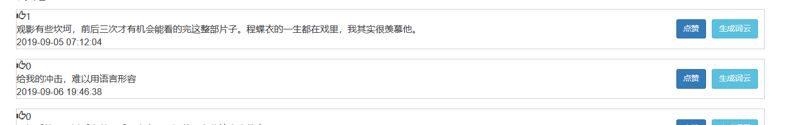
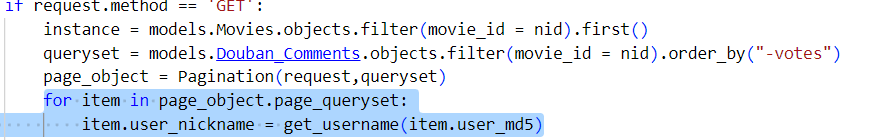

bug总结

1. 无法显示用户名

   

   

   解决方案：

   在queryset中添加一列信息：

   

2. navicat无法导入emoji

   在my.ini配置文件中加入以下内容：

   ```
   [client]
   default-character-set=utf8mb4
   [mysqld]
   character-set-client-handshake = FALSE
   character-set-server = utf8mb4
   collation-server = utf8mb4_unicode_ci
   init_connect=’SET NAMES utf8mb4’
   [mysql]
   default-character-set=utf8mb4
   ```

   将各个字符字段都设置为utf8mb4，即可解决。

   测试样例：

   ```mysql
   use movies_data;
   set names utf8mb4;#这句话很重要
   INSERT INTO myapp_douban_userinfo (`user_md5`, `user_nickname`) VALUES ('晓明',   '\n1.第一点\n2.🈶第二点\n1.\"A+B\"\n“C+D”\n3.第三点');
   
   INSERT INTO myapp_douban_userinfo (`user_md5`, `user_nickname`) VALUES ('新人',  '🔆太阳🔆，\n📍苹果🍎\n📍礼物🎁\n📍核心🎗\n📍典范🏅\n❤心');
   
   INSERT INTO myapp_douban_userinfo (`user_md5`, `user_nickname`) VALUES ('张某',  '🈶');
   ```

   